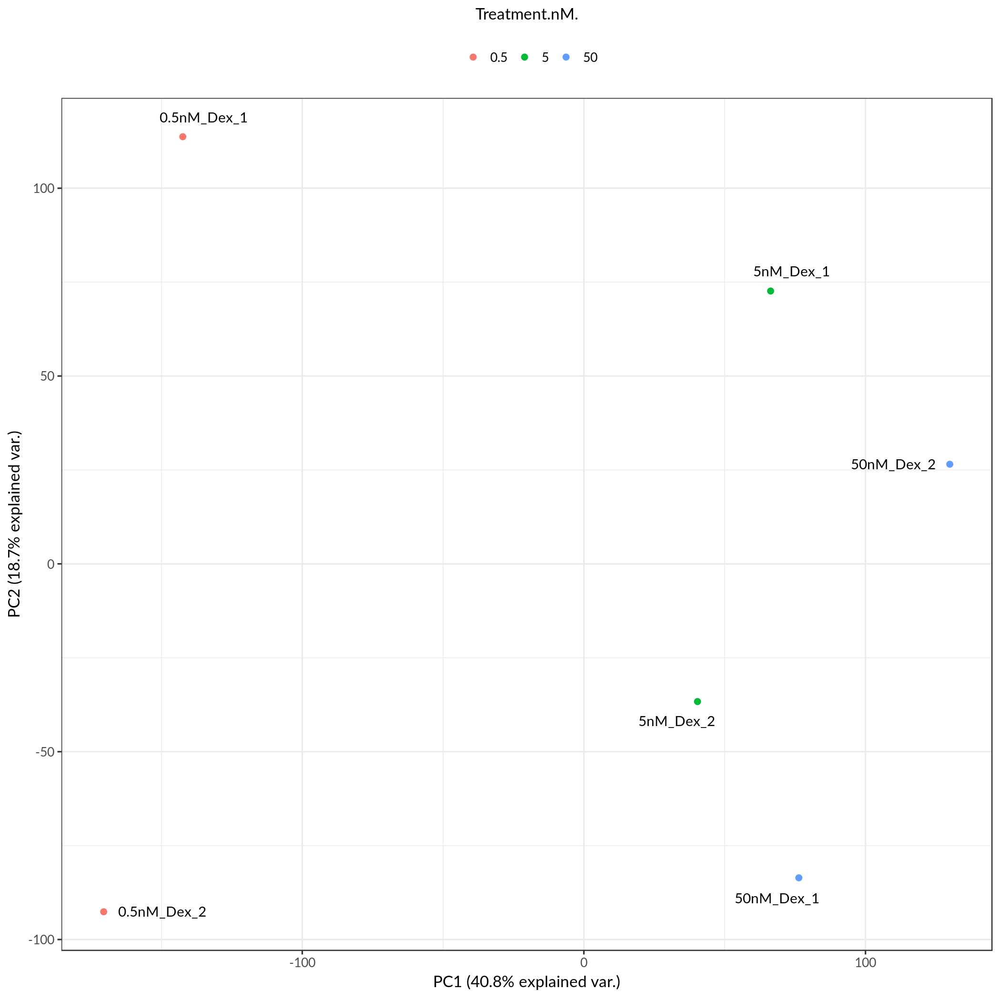
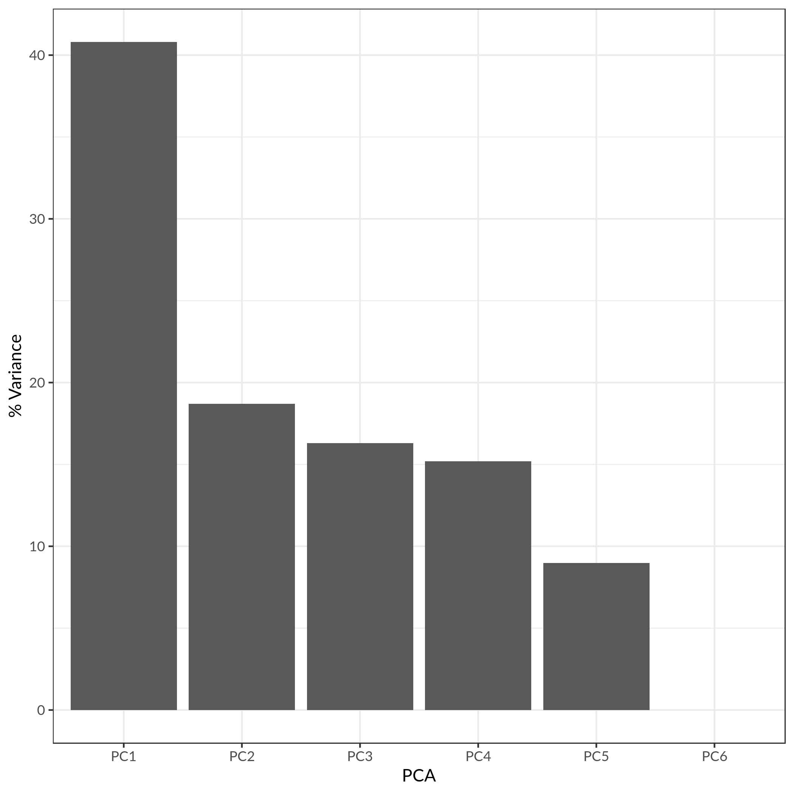
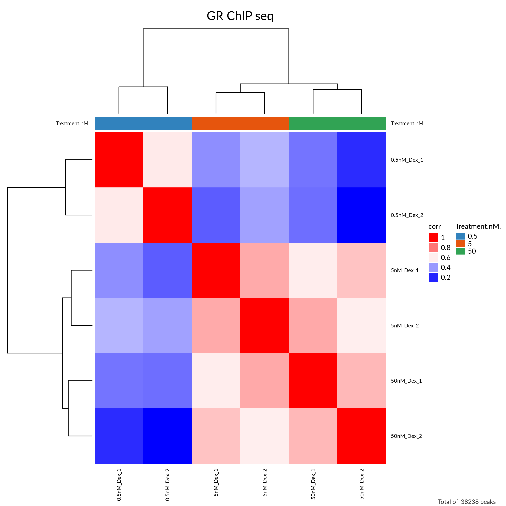
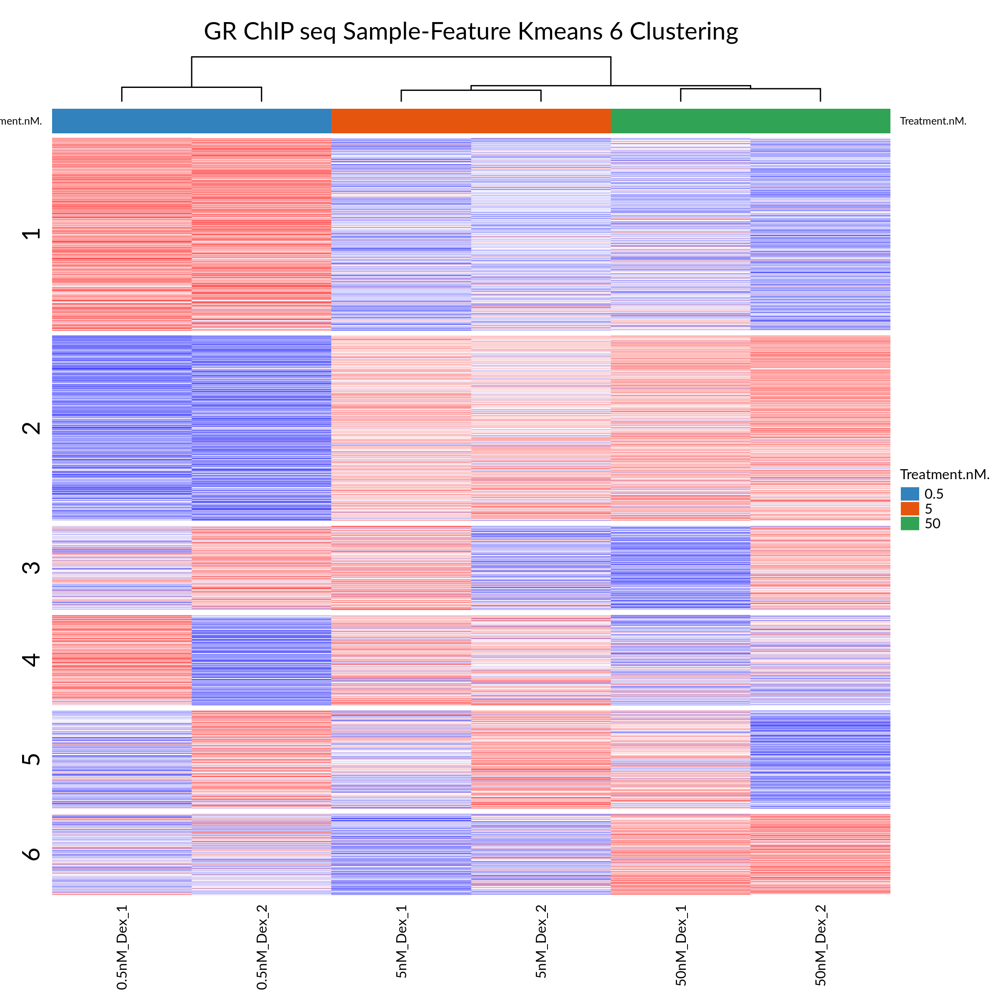
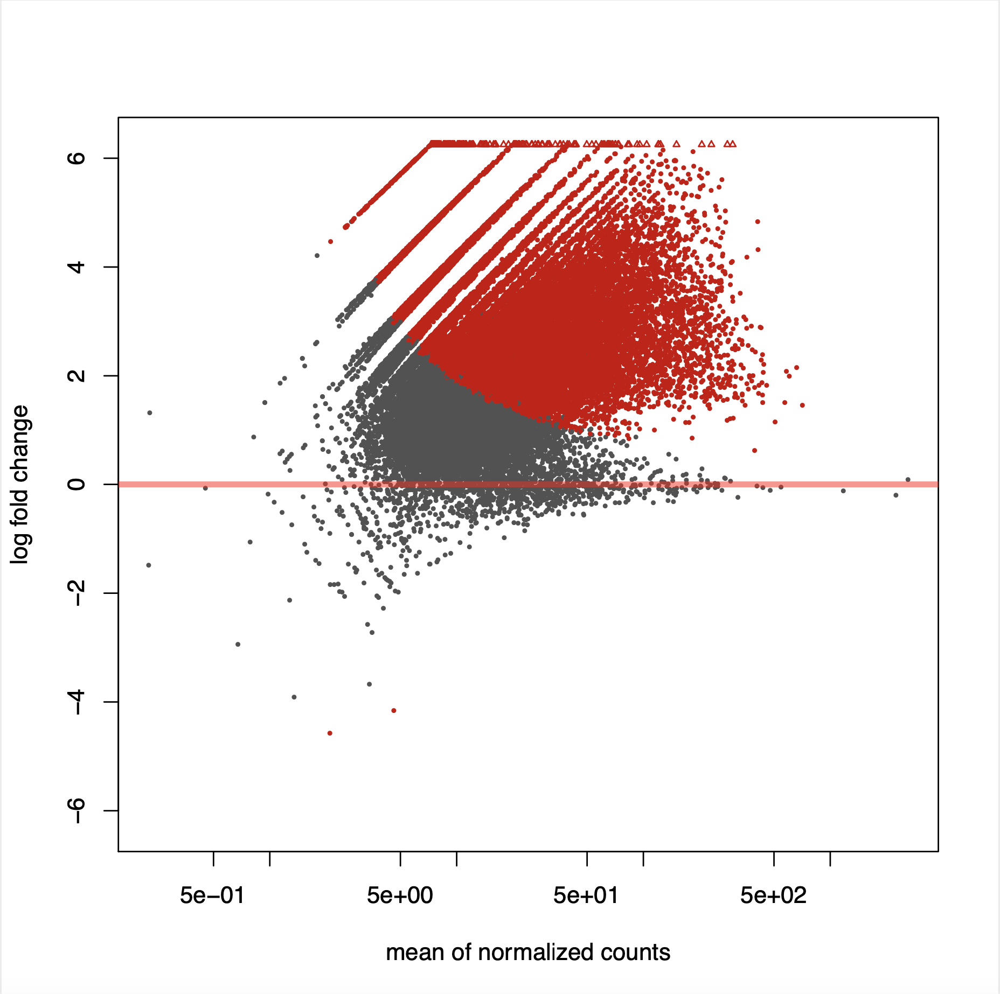
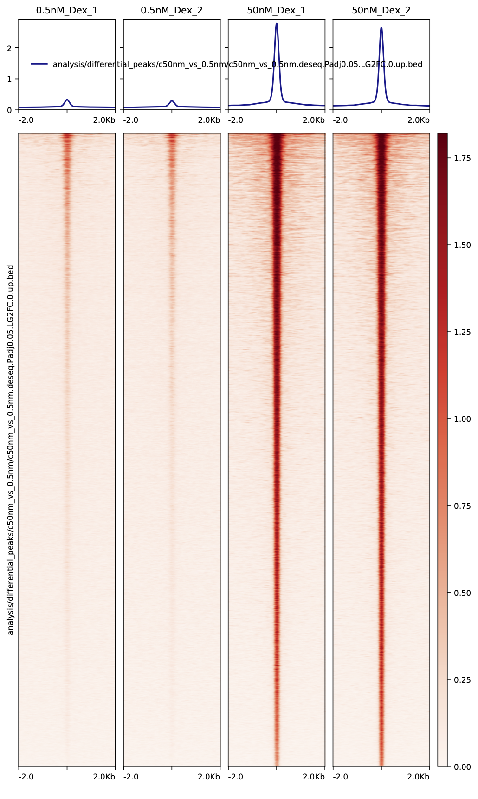

.. _docs-quickstart:

********
Tutorials
********

The three tutorials below gives you a taste of different capabilities of our CoBRA workflow. The data sets you will be exploring are, 
1) a glucocorticoid receptor (GR) ChIP-seq data set from the ENCODE project, 
2) a set of H3K27ac ChIP-seq data from colon cancer cell lines, and
3) an ATAC-seq experiment on HL-60 promyelocytes differentiating into macrophages. 

Each of the tutorials wiil demonstrate a subfield of expertise of our CoBRA pipeline. 

Setup
=====

In preparation for the tutorials, please use the following steps to set up the cobra environment and retrieve the latest version of our pipeline:

1. **Initiate Environment**: 
  
  Use the following command to activate the cobra environment:
  
  .. code-block:: Bash

    source activate cobra

2. **Retrieve the Latest Version of Cobra:**

  If installed using docker, run the following command to change the working directory. Otherwise, skip to next command:
   
  .. code-block:: Bash
   
     cd cobra
   
  Create a new directory for the tutorial (ex: gr_chip), change to the new working directory and pull the latest version of CoBRA using ``git clone`` :

  .. code-block:: Bash

     mkdir gr_chip
     git clone https://bitbucket.org/cfce/cobra.git .

  If you receive an error, *Git* may not be installed on your system. Please consult the internet on how to best install Git for your system.

Case Study 1: GR ChIP-set Data Set
================

Background
**********
This tutorial makes use of a publicly available glucocorticoid receptor (GR) ChIP-seq data (`GSE32465 <https://www.ncbi.nlm.nih.gov/geo/query/acc.cgi?acc=GSE32465>`_) from a lung adenocarcinoma cell line (A549) at 3 different concentrations of dexamethasone, a potent GR agonist. In the experiment, samples were treated with 0.5nM, 5nM, or 50nM of dexamethasone. 

Download and set-up for running the GR_ChIP sample dataset
**********************************************************

  Please use the following command to download the GR_ChIP sample dataset. This dataset is of moderate size (3.9 G) and may take 5-10 minutes to download. 

  .. code-block:: Bash
   
     snakemake download_example_GR_ChIP
  
  When the data set is downloaded, we can proceed to set up for the run. Usually for running CoBRA on a new experiment, the two config files ``config.yaml`` and ``metasheet.csv`` would need to be set up acccordingly. In this tutorial, they have been filled already. Note in ``config.yaml``, the parameter `motif` has been set as true to perform motif enrichement and clustering analysis.

  To check if the setup is correct, begin a dry run via the following command:

  .. code-block:: Bash

     snakemake all -np

Quick One-Step Analysis
**********************************************************

  Once the dry run completes without errors, run the pipeline using the following command (using 6 cores).

  .. code-block:: Bash

     snakemake all --cores 6

  Then wait for the result to come out in a few hours. It is plain and simple!

Step-By-Step Analysis
**********************************************************

  While the CoBRA pipeline is designed to be fast and efficient, easily-excuetable with just a few lines of commands, it is possible to produce the analysis in a step-wise fashion by running specific parts of the pipeline.

1. **Unsupervised Analysis - PCA Plot**: 

    .. code-block:: Bash

       snakemake pca_plot -f
  
  This command produces the ``pca_plot_100_percent.pdf`` file located in the ``analysis_result/clustering_analysis/rpkm.1_num_sample.0_scale.q_fliter.cov.100/plots`` folder. The first page of the file is a color-coded Principal component analysis (PCA) plot that depicts how samples are separated in the first two principal components (those with the largest variance). The second page includes a scree plot indicating the percentage of variance captured by each principal component

      
      As illustrated in the PCA plot, PC1 separates the samples with different treatment concentration of dexamethasone, while PC2 further    separates the sample replicates.
 

      As illustrated in the scree plot, PC1 captures over 40% of the variance explained, and PC2 captures about 19%.

2. **Unsupervised Analysis - Sample-Sample Correlation Plot**: 

    .. code-block:: Bash

       snakemake heatmapSS_plot -f
  
  This command produces the ``heatmapSS_plot_100_percent.pdf`` file located in the ``analysis_result/clustering_analysis/rpkm.1_num_sample.0_scale.q_fliter.cov.100/plots`` folder. It provides information on the clustering result based on the Pearson correlation coefficient, and illustrates the similarity between all samples in a pairwise fashion.
  

      
      As illustrated in the SS correlation plot, samples replicates cluster tightly together (r > 0.6). And samples treated with 0.5nM of dexamethasone exhibited to be dissimilar to samples treated with 5nM or 50nM dexamethasone.
 
3. **Unsupervised Analysis - Sample-Feature Heatmap**: 

    .. code-block:: Bash

       snakemake heatmapSF_plot -f
  
  This command produces the ``heatmapSF_plot_100_percent.pdf`` file located in the ``analysis_result/clustering_analysis/rpkm.1_num_sample.0_scale.q_fliter.cov.100/plots`` folder. It illustrates clustering of samples based on correlation on the horizontal axis and clustering of peaks on the vertical axis.
  

 

4. **Supervised Analysis - Limma/DeSeq2 Differential Peak Analysis**: 

    .. code-block:: Bash

       snakemake limma_and_deseq -f
  
  This command produces a series of files located in the ``analysis_result/differential_peaks/c50nm_vs_0.5nm`` folder, including the following:
  - ``c50nm_vs_0.5nm.limma.csv``: a differentail peaks analysis table produced by Limma
  - ``c50nm_vs_0.5nm.deseq.csv``: a differentail peaks analysis table produced by DESeq2
  - ``c50nm_vs_0.5nm.deseq.Padj0.05.LG2FC.0.up.bed`` and ``c50nm_vs_0.5nm.deseq.Padj0.05.LG2FC.-0.down.bed``: bed files of peaks that are differentially up- and down-regulated, respectively
  - ``c50nm_vs_0.5nm.deseq.sum.csv``: a table including total number of differential peaks under different thresholds
  - ``c50nm_vs_0.5nm.t.test.csv``: a t-test table of the differential peaks
  - ``MA_plot.pdf``: a MA plot comparing the two treatment samples
  

      
      
  
    .. code-block:: Bash

       snakemake snakemake deeptools_diff_peaks -f
  

       
  
  

5. **Cistrome Toolkit**: 

Case Study 2: H3K27ac ChIP-seq Data Set
================

Background
**********
This tutorial makes use of a publicly available glucocorticoid receptor (GR) ChIP-seq data (`GSE32465 <https://www.ncbi.nlm.nih.gov/geo/query/acc.cgi?acc=GSE32465>`_) from a lung adenocarcinoma cell line (A549) at 3 different concentrations of dexamethasone, a potent GR agonist. In the experiment, samples were treated with 0.5nM, 5nM, or 50nM of dexamethasone. 

